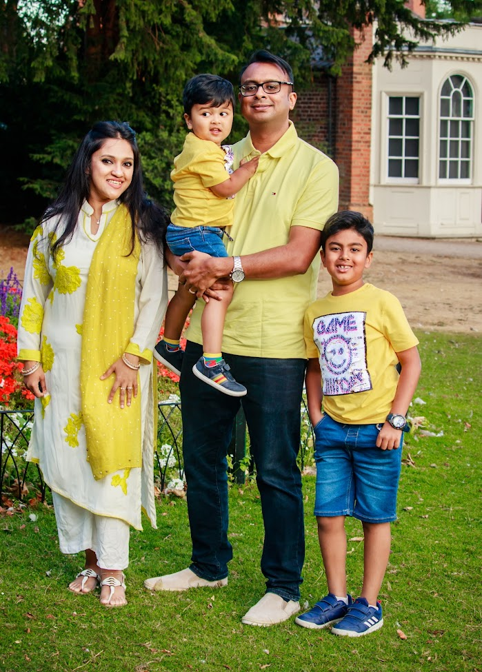

# Welcome to Syed's Home

## Life at present
{ width=200, align=right }
I am currently an Executive Director (Principal Cybersecurity Architect) working in Cyber Security and Technology Controls for JP Morgan Chase. I am also a member of the Industrial Advisory Board for Queen Mary University. 

My wife and I have two beautiful boys - Arzaan and Afaan who take up nearly all our time outside of work. 

If you would like to get in touch with me, please use one of the following email addresses or one of the social media handles:

* `syed.islam.10[at]ucl.ac.uk`
* `syed.islam.ucl[at]gmail.com`

## Work Experience

I previously worked as/at:

 * Vice President (Data Architect) at JP Morgan Chase.
 * Associate (Information Architect) at JP Morgan Chase.
 * Programme Leader & Senior Lecturer (Associate Professor) at University of East London.
 * Chief Architect at AvasUnion UK.
 * Research Associate at CHIME, University College London.
 * Research Associate at CREST, University College London.
 * Integration Engineer at Intercontinental Exchange (ICE Link) London.
 * Graduate Teaching Assistant at University College London. 
 * Graduate Teaching Assistant at King's College London.
 * Consultant Ornate i System, London.
 * Consultant at KernelSoft, Dhaka. 
 * Lecturer at Brac University, Dhaka.

## Education

I previously studied:

 * PhD. Advanced Computing Research at University College London.
 * MSc. Advanced Software Engineering at King's College London.
 * BSc. Computer Science and Computer Networking at London Metropolitan University.

## Certifications

I also have the following certifications:

 * AWS Solutions Architect Associate (SAA) 
 * Cisco Certified Network Associate (CCNA)
 * Graduate Certificate in Academic Practices (GCAP)
 * Postgraduate Certificate in Learning and Teaching in Higher Education

