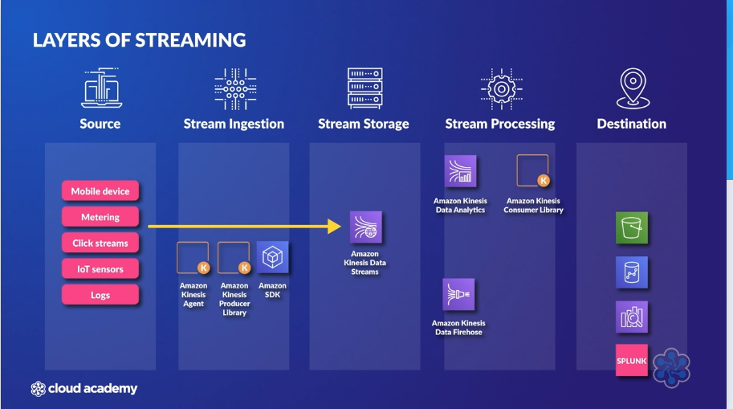

# Analytics

## Streaming Data - Amazon Kinesis
No Free Tier, each service has its own pricing based on attributes.

| Binary-encoded Data | Base64 text-encoded Data |
| --------------------| -------------------------|
| Amazon Kinesis Video Streams | Amazon Kinesis Data Streams |
| | Amazon Kinesis Data Firehose|
| | Amazon Kinesis Data Analytics |

### Pricing
 * Video Stream - Volume of Data ingested, Volume of Data Consumed and data stored across video streams in an account
 * Data Streams - Hourly charged based on shards whether data is there or not, data charges for putting data into stream, optional extended retention incurs charges hours charge per shard for data stored, number of consumers and amount of data. 
 * Firehose -  Data put into delivery stream, data transformed, delivery to VPC and number of AZs. 
 * Data Analysis - Hourly rate based on KPUS. KPU - 1 vCPU and 4 GB of Memory

### Layers of Streaming
{width=640}

## Amazon Kinesis Data Streams
### Properties
 * real-time data collection messaging service
 * Maintains a copy of all data in the received order
 * Data is stored for 24 hours default, up to 365 days if configured using ```IncreaseStreamRetentionPeriod```.
 * Ability to process large data streams in real-time, ability to read and replay records to multiple consumer applications. 
 * Kinesis Data Stream can encrypt data using KMS as producers put data on the stream.
 * Kinesis data stream has *put to get latency* of less than 1 seconds.

### Structure
 * Stream is made of one or more **Shards**
 * Shards hold **Data Records** in sequence. Shards can handle 1000 records/second. Write - 1000 records/second 1MB/second. Read - 2MB/seconds. 
 * Data Record is made of Partition Key (which shard), Sequence Number (per shard ordering) and Actual Data (up to 1MB). 
 * Producers put data on streams and consumers read data using Kinesis Client Library (KCL).
 * Kinesis Data Stream does not inspect or alter the data payload, consumers must do what is necessary. 
 * Data in streams are immutable.
 * Data can't be removed and can only expire.
 

### Kinesis Client Library (KCL)
 * KCL manages a Record Processor per shard ensuring data processed from each Shard.
 * KCL uses DynamoDB to store control data and creates one table per application reading data from a stream.
 * Can run on EC2, Elastic Beanstalk and Data Centre Servers. 

### Configuration
#### On Demand
 * Adjusts throughput based on demand
 * Billed for actual usage. 

#### Provisioned
 * Specify the number of shards
 * Billed for hourly provision of shards
 * Splitting and Merging shard operations happens during increase and decrease.

### Consumer
#### Classic/Standard
 * Pulls data from streams
 * Limits of how many times consumers can pull
 * This is also called the **polling mechanism**
 * 2 MBPs per second read throughput per shard. The limit is shared by consumers. 
 * 5 API Calls per second per shard. Get call returns 10K records. 
 * 200 milliseconds of latency. 

#### Enhanced Fan out
 * Every consumer gets 2 MBPs throughput per shard and limits are removed. 
 * ```SubscribeToShard()``` by consumer. Data is pushed to consumer at a rate or 2MBPs for 5 mins. 
 * Every consumer gets its own 2MBPs data pushed and removes the limit of 5 API Request. This push is done using HTTP/2.
 * This is a **push model** and not a pull model. 
 * Increased cost because of this
 * Soft Limit of 20 consumers registration per stream. Each consumer can be registered with a single stream at a time. 
 * 70ms of latency.

## Amazon Kinesis Video Streams
 * Stream processing binary-encoded data such as video and audio. 
 * Supports open-source project WebRTC which allows for two-way, real-time media streaming between web browsers, mobile applications and connected devices. 


## Amazon Kinesis Data Firehose
 * Streaming delivery service
 * Data can be dynamically transformed and scaled automatically to deliver to data store. Can transform to Parquet from JSON. Can use Lambda for transformation.
 * No need to develop custom consumers
 * Buffers data during delivery, Buffer Size and Buffer Duration can be configured during creation. This buffering makes it near real-time. Buffer size is configured at the time of creation. Buffer interval can be between 60-900 seconds.
 * This is **not** a streaming storage layer.
 * Destinations:
    * Amazon S3
    * Amazon Redshift
    * Amazon Elasticsearch
    * Splunk
    * Generic HTTP endpoints
    * DataDog
    * MongoDB Cloud
    * New Relic
 * No free tier, charged for usage not provisioned. Charges are for only while data is inside Kinesis Data Firehose.

## Amazon Kinesis Data Analytics
 * Read from stream real-time and analytics on streams
 * Only **SQL** available when used with **Firehose**
 * **Apache Flink with Java and Scala** are available with only **Data Streams**.
 
  


