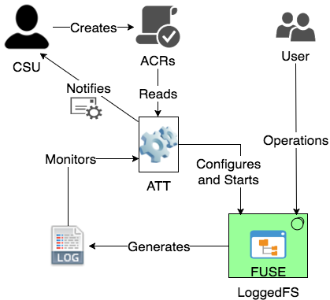

# Automated Security Transparency

## Overview

{ width=300, align=right }
Automated Security Transparency Tool (ATT) is our automated security transparency tool. ATT is written in Java which makes it highly portable and platform independent. Figure on the right shows the system architecture of ATT. The main tasks performed by various components of the tool are to read ACR specification and generate a security matrix, enable logging of the resource interactions, monitors resource interactions, identify violations against the security matrix and send notifications in the event of violations.

The current version of ATT is able to parse ACR statements written in ASRL . ATT provides options for importing plain text files containing ASRL and provides significant feedback on syntax errors in order to aid resolve any specification errors. Once a specification file is successfully parsed, ATT generates an in-memory security matrix corresponding to the file. This security matrix is vital to the monitoring operation.

Following creation of the security matrix, the tool interfaces with the user interaction logging component and starts the logging process. As an initial implementation, we used LoggedFS as our logging system. LoggedFS is a FUSE based filesystem which can log every operation to the underlying file system in real-time and as it happens. Once the logging process is enabled, any request for interaction to monitored resources generates a detailed logged entry which is consumed directly by ATT enabling real-time usage monitoring. The monitoring is done against security matrix and any violation of defined ACRs or attempted breach is identified.

## ATT Download

|	Download Link |	Description|
|-----------------|-----------------|
| [ATT]() |	ATT Distribution.|

## System Requirements
### Java Requirements

Java_1_8 is required to run ATT.

Fortunately, its quiet easy to get it running on Linux even without root. Just do the following:

 1. Download the JDK as a tarball from Oracle
 2. Unzip it somewhere in your HOME (for instance, HOME/jdk).
 3. Set JAVA_HOME to the path of the root JDK install

For example,
 1. `export JAVA_HOME=/cs/research/crest/home0/sislam/opt/jre1.8.0_65`
 2. `export PATH="$JAVA_HOME/bin:$PATH"`

The current version of ATT is also limited to Linux Distributions as it requires supporting tools which are detailed below.

### Utility Requirements
You need to have the following tools installed on your machine:
 1. FUSE
 2. LoggedFS

Most Linux Distribution will come with FUSE. On Ubuntu you can use the following commands to install FUSE:

```bash linenums="1"
  sudo apt-get update
  sudo apt-get install librlog-dev libfuse-dev libxml2-dev libpcre3-dev
```

If Loggedfs is included in your distribution you can just install with your package manager. Otherwise follow instructions at [LoggedFS website](https://rflament.github.io/loggedfs/) to install from source.

## Troubleshooting and Help
If you are having trouble running the tool or need any help with installation please contact [me](../index.md).

