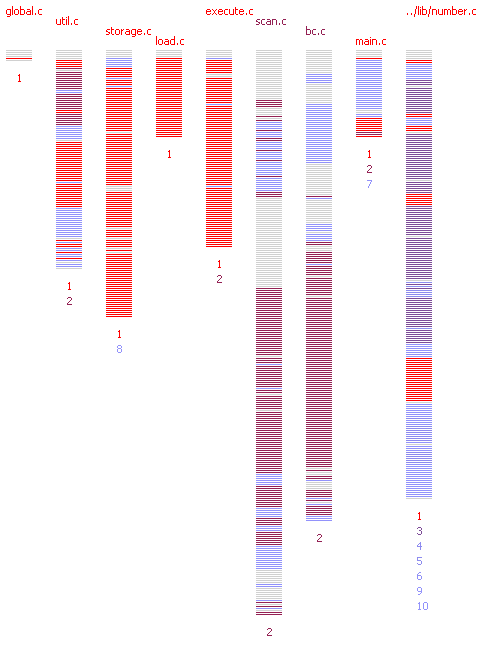

# Program Analysis Projects

## deCluVi: Dependence Cluster Visualisation

### Overview
deCluVi is a multi-level software cluster visualisation tool. The tool has two graph based visualizations B-SCG and the F-SCG. Four other views, starting with the most abstract are the heat-map view, system view, line view and finally the code view. The tool is designed to be interactive and each of these views are presented in its window for ease in comparison and to maximize available screen space. Sliders and quick snap buttons allow quick selection of particular and a range of clusters. Dynamic coloring, range filtering and dead code elimination options make it easier to visualize and understand the software clusters. A paper on cluster visualization gives more detail about the tool.

The tool and the data set for visualising many GNU programs are given below. The scheme scripts for extracting data from CodeSurfer is also provided if you wish to analyze other programs. After starting the tool you will need to select the scheme output file which can be found in the source directory for each of the programs.

### Screen Shots
{width=200}
{ width=200}
{ width=200}
{ width=300}
{ width=300}

### Tool Download
The current version of the deCluVi can be downloaded from [here](../static/deCluVi.jar).

Visualisation data for transformed versions of GNU programs for coverage based clustering:

 * [bc-1.06.tar.gz](../static/bc-1.06.tar.gz)
 * [byacc-20100610.tar.gz](../static/byacc-20100610.tar.gz)
 * [cflow-1.3.tar.gz](../static/cflow-1.3.tar.gz)
 * [ed-1.2.tar.gz](../static/ed-1.2.tar.gz)

### Scheme Script
The scheme script to extract slice data from Code Surfer can be downloaded from [here](../static/script.stk).
(Please note that the script is compatible with version 2.1 of Code Surfer)

## Observation-based Program Slicing (ORBS)
### Overview
{ width=400, align=right}
Current slicing techniques cannot handle systems written in multiple programming languages. Observation-Based Slicing (ORBS) is a language-independent slicing technique capable of slicing multi-language systems, including systems which contain (third party) binary components. A potential slice obtained through repeated statement deletion is validated by observing the behaviour of the program: if the slice and original program behave the same under the slicing criterion, the deletion is accepted. The resulting slice is similar to a dynamic slice.

We evaluate five variants of ORBS on ten programs of different sizes and languages showing that it is less expensive than similar existing techniques. We also evaluate it on bash and four other systems to demonstrate feasible large-scale operation in which a parallelised ORBS needs up to 82% less time when using four threads. The results show that an ORBS slicer is simple to construct, effective at slicing, and able to handle systems written in multiple languages without specialist analysis tools.

### PORBS Download
PORBS is currently distributed as JAR executable file. You can download any of the following which has the tool distribution along with the required scripts to build and execute the system being sliced. Each download comes with a README explaining how to run the example.

|	Download Link |	Description|
|-----------------|-----------------|
| [Example](../static/Example.tar.gz) |	Multi-language System written in Java, Python and C. Setup to slice on variable dot.|
| [Sort Uniq Utility](../static/SortUniq_s.tar.gz) |	Sort and Uniq utility written in Java. Configure to slice with input file and option "-s"|
| [Sort Uniq Utility](../static/SortUniq_u.tar.gz) | Sort and Uniq utility written in Java. Configure to slice with input file and option "-u"|
| [Word Count](../static/case_wc_c_45.tar.gz) |	Word Count example, line 45, variable *c*.|
| [Word Count](../static/case_wc_inword_29.tar.gz) |	Word Count example, line 29, variable *inword*.|

### System Requirements
#### Java Requirements
Java_1_8 is required to run PORBS.

Fortunately, its quiet easy to get it running on Linux even without root. Just do the following:

1. Download the JDK as a tarball from Oracle
2. Unzip it somewhere in your HOME (for instance, HOME/jdk).
3. Set JAVA_HOME to the path of the root JDK install

For example,
```bash linenums="1"
export JAVA_HOME=/cs/research/crest/home0/sislam/opt/jre1.8.0_65
export PATH="$JAVA_HOME/bin:$PATH"
```
#### Utility Requirements
The compile and execute script will need the following to run correctly. Note that some specific systemm will have additional requirements. Please refer to README of the download for more details.

For example,
 
 1. `bash`
 2. `time`
 3. `timeout`
 4. `KILL`
 5. `md5sum`
 6. `sed`

Most Linux Distribution will come with these utilities installed as default.

!!! warning "Mac OS"

    MAC OS does not have these utilities installed by default. You have to either adapt the scripts or install the utilities.

### Troubleshooting and Help
If you are having trouble running the tool or need any help with installation please contact [me](../index.md).

### Further Information
Further information about ORBS and the sequential ORBS slicing tool is available from the official [ORBS Website](http://crest.cs.ucl.ac.uk/resources/orbs/).

## Energy Measurement and Program Slicing
### Explanation of the data format
The intial dataset for the subject program can be downloaded from below. Each download gives you a tarball with roughly the following directory structure:

##### config
 * `setup.sh` - setup script for the project, should setup the project for execution. For example: `sh config/setup.sh` should setup the code in a directory called orig ready for execution and compilation.
 * `compile.sh` - compile script for the project. For example: `sh config/compile.sh orig` should compile the code in corresponding orig directory.
 * `execute.sh` - execute script for the project. For example: `sh config/execute.sh orig` should execute the code in corresponding orig directory and show output.

##### orig
Contains the original source files which of the subject program to be tested.

##### regression
Contains the output of the slicer. Each directory in regression is the resulting output of running the slicer on variable v in source file f at line l.
For instance, in the program Example you will find the directory `regression/checker_java_14_dots-8`, where

 * `checker_java` - is the name of the file *f*
 * `14` - line number *l*
 * `dots` - variable *v*
 * `8` - window size for the slicing configuration (ignore this for now)

###### Description of Log Files
The regression directory also contains the following log files which gives you detailed information about the execution of ORBS and how it progresses:

 * `orbs.log` - Contains the execution attempt that ORBS does at each line and the result of that execution effort.
     * **Headers** - The first part of the log file gives details of the version of the Parallel ORBS tool in use followed the the configuration specific to the execution.
     * **Scipts** - This is followed by a copy of the compile, execute and the setup scripts in use during this execution
     * **Oracle** - The line with the header `Oracle:` contains the md5sum of the output that ORBS is using as oracle and will try to match.
     * **Sanity Runs** - The log file then includes `Sanity Run [X]` which are there to ensure that the oracle can be achieved by the ORBS framework.
     * **Marking Blank Lines as Deleted** - The current version makes a pass over the entire file and marks all blank lines as deleted. `Marking blank lines as deleted` shows the lines removed from each file that ORBS is working with.
     * **Orbs Execution** - This is followed by the ORBS execution and attempt at deletion of the lines and their outcome. The explanation of the line `I:1 F:checker.java L:14 DWS:2 D [14 13]` is as follows:
         *  `I:1` - `I` stands for iteration number. The `1` shows that this is iteration 1 for ORBS
         *  `F:checker.java` - `F` stands for file name. `checker.java` is the file from which ORBS was attempting deletion
         *  `L:14` - `L` stands for line number. `14` is the line number where the deletion attempt took place
         *  `DWS:2` - `DWS` stands for Deletion Window Size. The number `2` indicates that deletion window size of 2 was successful and hence two lines were removed. DWS:0 would indicate no deletion was successful at this line.
         *  `[14 13]` - Indicates the lines that were deleted. In this case lines `14` and `13` were successfully deleted and replaced with a blank line. Please note that this only shows up if there were lines that were successfully deleted by ORBS.
    *  **Statistics** -  At the end statistics such as *Total Compilation, Total Executions, Total Cached Compilations, Total Cached Executions, Lines Deleted* and *Total Lines* are output.
 * `DeletePattern.log` - This file prints a pattern of the removal that took place. The format of the file is as follows:
     * The first line of the log file indicates the order of the files which were operated on by ORBS.
     * The second line is the line where ORBS makes a pass to mark all blank lines as removed.
     * Each of the following rows represents an iteration of ORBS on the files.
     * The symbol `|` is used to delimit the operation on each of the files.
     * The symbol `-` represents unsuccessful attempt to remove line.
     * The symbol `.` means line already removed in previous iteration.
     * The symbols `a-z` represents number of removed lines. `a` means 1 line removed while `eeeee` means 5 lines removed.

### Data Download
 * [Example](../static/example.zip)
 * [Word_Count_1](../static/wordcount_1.zip)
 * [Word_Count_2](../static/wordcount_2.zip)


!!! abstract "Apologies"

    I realized that this naming convention above is quiet poor! Please excuse it for now and I will put in a fix with a more intuitive naming convention for the upcoming data.