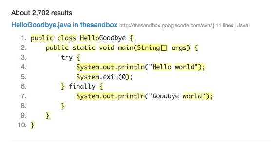

# Project Ideas for Students

This page is dedicated to listing and describing a few of the project ideas that I have. Depending on the project they will be suitable for different levels of students from UG to PhDs.

I am interested in supervising undergraduate and postgraduate projects. If you are interested in projects that are research oriented, have practical technical components to them and are related to software engineering, please feel free to contact me to discuss your ideas.

I am also interested in PhD supervision in the fields of software engineering, dependence analysis, search-based software engineering and program analysis. I am also happy to co-supervise in other areas.

You may want to look into my research interests or specific project ideas below to see if there is anything that is of interest to you.


## Areas of Interest
 * Software Engineering
 * Software Development
 * Machine Learning
 * Program Analysis
 * Code Metrics
 * Static Analysis
 * Dynamic Analysis
 * Search-based Software Engineering
 * Software Visualisation

## Project Topics

Click on the links below to view details of topic.


| Project Title | Entailing Areas | 
| ----------| -------------------------------------------------------- |
[Annoying Captcha!](#annoying-captcha) |	Image processing, Speech processing |
[How much code are you writing?](#how-much-code-are-you-writing) |	Program Analysis, Software Metrics|
[Web Portal for ORBS](#web-portal-for-orbs) | Web Application Development|
[Improving slicing performance through binary masking](#improving-slicing-performance-through-binary-masking) |	Program Trasformation, Re-writing, Static Analysis, Dynamic Analysis|
[Binary-level program Slicing](#binary-level-orbs-slicing) |	Program Trasformation, Re-writing, Static Analysis, Dynamic Analysis, Binary Analysis|
[Software Repository Mining](#software-repository-mining)|	Data mining, Software repository mining, Data Analysis, Software Metrics\
[App Store Mining](#app-store-mining) |	Requirement Analysis, Next release problem, Data mining, Software repository mining, Data Analysis, Software Metrics|
[Search-based Software Slicing ](#search-based-software-slicing) |	Search-based Software Engineering, Genetic Algorithm, Program Slicing, Static Analysis, Dynamic Analysis|
[Path to riches - Algorithimic Trading](#algorithimic-trading)|	Trading Algorithms, Automated Trading, Metatrader, High Performance Trading, Technical Analysis, Machine Learning, Evolutionary Algorithms|
[Automated Bug Triage](#automated-bug-triage)|	Machine Learning, Data Analysis, Natural Language Processing, Latent Dirichlet allocation, Support Vector Machine|
[Automated Assessment](#automated-assessment)|	Web Application Development, Sandboxing, Software Security, Plagiarism Detection, Clone Detection, Code Provenance|
[Software Visualisation](#software-visualisation)|	Software Visualisation, Web Systems Development, JavaScript, D3|
[Improving battery life on your phone](#energy-measurement-for-mobile-platforms)|	Mobile App Development, Energy Measurement|
[Energy Consumption in the Cloud](#energy-measurement-for-cloud)|	Cloud Computing, Energy Measurement
[Smart Scheduling](#smart-scheduling)|	Evolutionary Algorithms, Genetic Algorithms, Machine Learning, Search-based Software Engineering, Hill Climbing, Scheduling, Web Application Development
[Smart Tokenized ORBS](#token-orbs) |	Program Trasformation, Re-writing, Static Analysis, Dynamic Analysis, Program Slicing
[Delta Orbsing](#delta-orbs)| Delta Debugging, Delta, Program Trasformation, Re-writing, Static Analysis, Dynamic Analysis, Program Slicing
[Brain Region Routing Problem](#region-connectivity) |	Steiner Minimal Tree, Graph Theory, Networks, Shortest Path, Routing Problem, Web Application Development, Software Visualisation
[Anti-Money Laundering System](#anti-money-laundering-system)|	Compliance, Natural Language Processing, NoSQL, Scrapping,


### Annoying Captcha?

I regard Captcha's as the necessary evil. Modern web systems are littered with Captchas and they are required in many cases to avert bots that try to get into the system. However, there are some instances where I find them very annoying, I always wanted to look into breaking Captchas but never had the time.

This project will look into the current techniques to breaking Captchas and extend the state of the art with techniques and tools for breaking captchas?

### How much code are you writing?

Everyday programmers write code, but how much of the code written is actually new. For example, if you were write a small program in Java, can you actually write something that hasn't been written before? For instance consider the following program:

```java title="Hello.java", linenums="1"
public class Hello {
    public static void main (String[] args){
        System.out.println("Hello, World");
    }
}
```
How much do you think can be found on the web? This is the result of searching for the code.



### Web Portal for ORBS
In computer programming, program slicing is the computation of the set of programs statements, the program slice, that may affect the values at some point of interest, referred to as a slicing criterion. Program slicing can be used in debugging to locate source of errors more easily. Observation-based slicing (ORBS) is a novel language-independent slicing technique that revives the original spirit of program slicing, that is, remove/delete parts of the program that does not contribute to the point of interest. A potential slice is obtained through repeated deletion which is validated by observing the behaviour of the program: if the slice and original program behave the same under the slicing criterion, the deletion is accepted.

This project will gather requirements to release ORBS as a web portal where people can submit their code and later visualise and download slicing information for their systems.

### Improving slicing performance through binary masking
Program transformation and automatic re-writing tools play a vital part in research. A tool that allows you to automatically add a mask at each line of code to make the line conditionally executable based on some external environment variable would have many experimental applications in program analysis research. One area where this could be immediately applied to is program slicing, in particular ORBS.

This project will develop a program transformation re-writing tool where each line of code can be made conditionally executable based on some external environment variable.


### Binary-level ORBS Slicing
In computer programming, program slicing is the computation of the set of programs statements, the program slice, that may affect the values at some point of interest, referred to as a slicing criterion. Program slicing can be used in debugging to locate source of errors more easily. Observation-based slicing (ORBS) is a novel language-independent slicing technique that revives the original spirit of program slicing, that is, remove/delete parts of the program that does not contribute to the point of interest. A potential slice is obtained through repeated deletion which is validated by observing the behaviour of the program: if the slice and original program behave the same under the slicing criterion, the deletion is accepted.

This project will apply the ORBS approach at binary level. For this student will need to identify current binary re-writing techniques and tools and use that in conjunction with ORBS to develop a binary slicer.

### Software Repository Mining
Open-source code and projects are now in abundance more than before. These repositories (eg. Github, bitbucket etc.) provide wealth of information about actual real-world software development. For example, we can understand how code evolved over time, how bugs that were reported were fixed, what techniques and methodology the software development process followed etc. We can even work to find similarities in the repositories identify a host of code metrics.

This project will identify the current tools and technologies available for mining these open software repositories and will look to develop and extend them to allow improved data mining and analysis.

### App Store Mining
The software development domain is always evolving, with new paradigms being continually introduced. Since, the launch of the iPhone in 2007 the concept of smart phones have really taken off. With ~967.78m smart phone sold there is no shortage of application users. The market is dominated by three stores where apps are available for download, namely, Apple Store, Google Play and Blackberry Store. These store have a huge number (~1m) of apps available, often with description and various other information related to the app and in some cases even reviews. They also have a price associated with them. Analysis of this data will allow us to gain an insight into the current software development market and trend.

This project will identify the current tools and technologies available for crawling app stores and will look to develop and extend them to allow app store data mining and analysis.

### Search-based Software Slicing
In computer programming, program slicing is the computation of the set of programs statements, the program slice, that may affect the values at some point of interest, referred to as a slicing criterion. Program slicing can be used in debugging to locate source of errors more easily. Current program slicing techniques cannot handle systems written in multiple programming languages. Observation-based slicing (ORBS) is a novel language-independent slicing technique capable of slicing multi-language systems including systems which contain (third party) binary components. A potential slice obtained through repeated statement deletion is validated by observing the behaviour of the program: if the slice and original program behave the same under the slicing criterion, the deletion is accepted.

This project will use the ORBS approach to develop a search-based approach to program slicing.

### Algorithimic Trading
The Forex Trading market is the largest and the most liquid market in the world with and estimated $5.3 Trillion being traded every single day. This market is rife with automatic trading algorithms that are trading to make a profit.

This project will investigate the current approaches and tools available for automatic trading and develop algorithms and tools to support automated trading, with an aim to make profit, of course! The approaches can come from various domains of computing including machine learning and evolutionary algorithms etc.


### Automated Bug Triage
Most large software development projects use some form of bug tracker system. Some popular ones are Jira, YouTrack, IBM Rational, Bug-Track, Bugzilla etc. When a new bug report is filed, a human needs to look at the bug report and triage the bug in order to identify whether its an actual bug. The triage process then tries to identify a developer who the bug should be assigned to. Although this approach works pretty well for software companies where the manager does the assignment and is aware of the capabilities of his team, the scenario is very different for open systems.

This project will develop tools and support for automatic bug triage and assignment to developers. This would incorporate areas such as data mining, machine learning, search-based optimisation techniques.


### Automated Assessment
Almost all Computer Science related courses taught at universities will have modules where programming languages are taught. In the case of UEL we have courses taught in Java and php. Often, it is helpful if a automated assessment system can be employed to test and grade programming assignments submitted by students.

This project will investigate the current tools and software support available for automated assessment of programming assignments and extend support. This is an ideal project for someone who is interested in web application development. If this project is successful we can look towards a live implementation for the department.


### Software Visualisation
Software visualisation helps us see information and understand data very easily. In moder times we can take advantage of HTML5 and progress in browser technology create very useful and attractive visualisations.

This project will develop a graph visualiser in support of processing and viewing various data and graphs.

### Energy Measurement for Mobile Platforms
Traditionally software development has placed a lot of emphasis on functional requirements. However, in modern software systems non-functional requirements play a vital role, for example, for mobile applications it is very important to know the amount of energy consumed by a piece of software. The software on my iPhone will not be of much use if my phone runs out of battery.

The goal of the project will be identify the current state-of-the-art in energy measurement and extend support for software and tools to capture data about energy usage for mobile apps. This project is ideal for students who are interested in mobile application development.


### Energy Measurement for Cloud
We are seeing a huge shift in technology and how it is being used by end-users. Almost all applications are making a shift to the cloud. This is no longer true for only services like email but for more traditional applications desktop-based applications such as word processing software. Everyday technologies that we such as Gmail, Dropbox, Office 365 are now all cloud-based. The biggest cost for cloud operators is energy usage.

The goal of the project will be identify the current state-of-the-art in energy measurement for desktop and cloud systems and extend support for software and tools to capture energy usage in these systems. This project is ideal for someone who is interested in cloud computing.

### Smart Scheduling
Job shop scheduling (or job-shop problem) is an optimization problem in computer science and operations research in which ideal jobs are assigned to resources at particular times. The most basic generic version can be simplified to our Timetabling problem. At UEL within the department we schedule modules each semester taking into various constraints. Some of these constraints are:

 * Ensure lecture/lab/tutorial timings don't clash
 * Ensure individual students timetable don't clash
 * Ensure individual academic timetable don't clash
 * Ensure that students and lectures are not overworked on a particular day
 * Ensure appropriate gaps between sessions for students and lecturers
 * Account for specific lecturer, room and resource constraints

This project will investigate the current practice for timetabling at the department, identify requirements of the proposed system and then develop and deploy a web application to solve the problem.

### Token ORBS
In computer programming, program slicing is the computation of the set of programs statements, the program slice, that may affect the values at some point of interest, referred to as a slicing criterion. Program slicing can be used in debugging to locate source of errors more easily. Observation-based slicing (ORBS) is a novel language-independent slicing technique that revives the original spirit of program slicing, that is, remove/delete parts of the program that does not contribute to the point of interest. A potential slice is obtained through repeated deletion which is validated by observing the behaviour of the program: if the slice and original program behave the same under the slicing criterion, the deletion is accepted.

This project will investigate how to improve the accuracy of ORBS. This project can take one or both approaches where ORBS remains language-independent or includes language features. For the former, we can look at generic tokenizing of the code text to improve accuracy by removing at token-level rather than line-level. For the latter, we can look at tokenizing language constructs and operating on those.

### Delta ORBS
To be defined...

### Region Connectivity
Computation and visualisation of connectivity between the different regions of the brain is vital for many tasks such as disease identification, drug discovery and disease propagation etc. An effective visualisation can aid clinicians and biologists perform these tasks addressing a genuine research and industrial needs.

This project will investigate and develop techniques to identify the connectivity and dispersion paths between various brain regions or similar biological structures.

### Anti-Money Laundering System

To be defined...